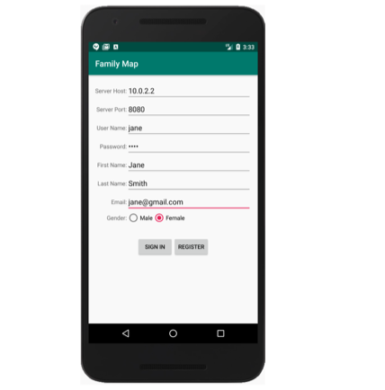
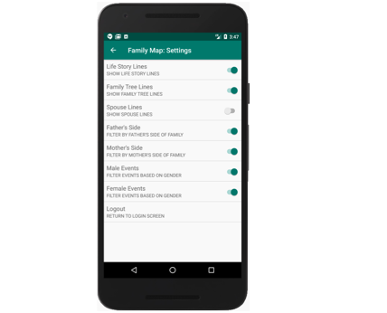
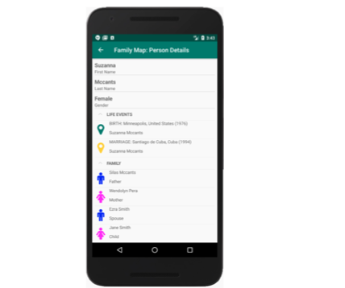

# Introduction
Family Map is an Android application that provides a geographical view into your family history. One of the most exciting aspects of researching family history is discovering your origins. Family Map provides a detailed view into where you came from.
Purposes
The purposes of this project are to dig a little deeper into the following:
* Object-Oriented Design
* User Interface Programming
* Native Android Development
* Calling external services through Web APIs
* Unit Testing
# Family Map Client: A Quick Overview
The Family Map Android application consists of five main views:
* Main Activity (Login and Top-level map)
* Event Activity (Lower-level maps)
* Person Activity
* Settings Activity
* Search Activity
# The Family Map Client application uses two external services:
* Family Map Server - Used for user management, data generation, and requesting data (this is the Family Map Server you created in the previous project)
* Google Maps v2 for Android or Amazon Maps v2 for Kindle - Used for displaying maps

# Some Screenshots From the App

